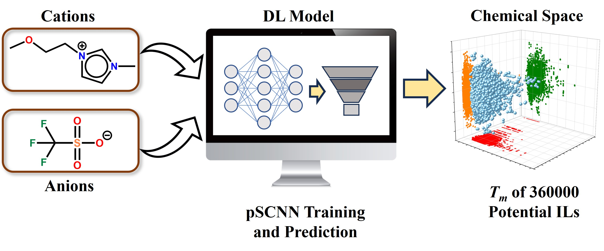

pSCNN
===

The pSCNN repository includes all materials for the prediction of the normal melting points of ionic liquid. It contains the trained models via five-fold cross-validation (model_[0-4].keras), a package with zscore standardscaler and 209 Mordred molecular descriptors(for-external.pkl), one package with all data for training(Ils_all_data.pkl), an excel file with examples(NIST-39.xlsx), an excel file for the predicted Tms of all potential new ILs(potential-ILs-Tm.xlsx), and a python script (prediction.py). 

In the excel file, two columns are required, one for SMILES and one for NAME, where SMILES is listed as smiles of ionic liquids, with the smiles of cations in the front. The melting points of ionic liquids ('TM') is optinal. 

  

      
Requirment 
===

Python 3.10 and related packages, RDKit(2023.09.1), Mordred descriptor, and Tensorflow (2.14.0). 

Data availability
===

  The dataset is stored in Ils_all_data.pkl, which consist of melting points, smiles and RDKit mol objects of all 3098 ionic liquids. 

Download the models and run directly
===

   * python3.10 prediction.py NIST-39.xlsx

Contact
===
  
  Anan Wu: ananwu@xmu.edu.cn
